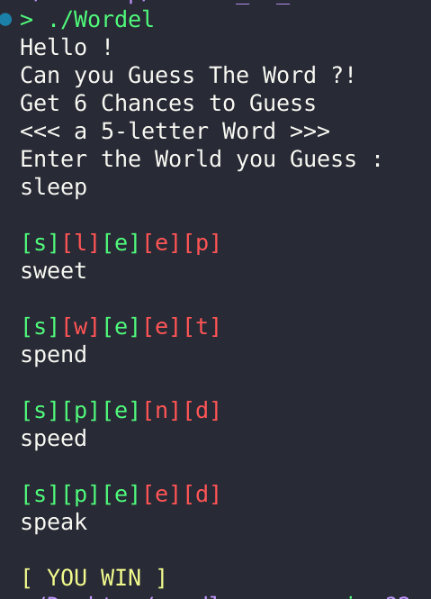
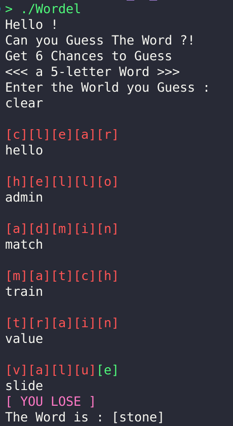

# Wordle_on_C 🔤 - Terminal Wordle Game


A terminal-based version of the famous Wordle game built entirely in C, designed for fun and practicing core C concepts and logic implementation.

---

## 🧠 Overview

**Wordle_on_C** is a mini-game where the player must guess a **5-letter word** randomly chosen from a word database.

You have a limited number of tries to find the correct word.  
Each attempt gives you feedback by coloring each letter:

- 🟩 **Green** if the letter is correct and in the right position.  
- 🟥 **Red** if the letter is incorrect or in the wrong position.

This project was made entirely for fun and learning and follows **42 Norminette** standards.

---

## 🧪 Example Gameplay

<div align="center">
  
</div>

<div align="center">
  
</div>

---

## ✨ Features

- ✅ Terminal-based interface using colors
- ✅ Word validation against a word list
- ✅ Feedback after each attempt (Green for correct, Red for incorrect)
- ✅ Limited number of tries to win
- ✅ Random word selection from database
- ✅ Fully compliant with 42 Norminette
- ✅ Custom implementations (no system() or malloc leaks)
  - `ft_strdup`, `get_next_line`, and more

---

## 🕹️ How It Works

1. At launch, the game picks a random **5-letter word**.
2. You enter your guess word by word.
3. The game shows:
   - Green for each correct letter in the correct place
   - Red for letters that are incorrect or misplaced
4. You win if you guess the word within the allowed tries.

---


## 🛠️ Installation

1. Clone the repository:
```bash
git clone https://github.com/oussama-fa/wordle_on_c.git
cd wordle_on_c
```

2. Compile the game:
```bash
make
```

3. Run the game:
```bash
./wordle
```

---

## 🔤 Word Rules

- All words must be exactly **5 characters**.
- Valid words must exist in the `database.txt` file.
- Case insensitive (converts everything to lowercase).

---

## 🧠 Technical Details

- **Language:** C
- **Custom Functions:** `ft_strlen`, `ft_strdup`, `get_next_line`, etc.
- **Input Handling:** stdin with validation
- **Randomness:** Seeds random word from database
- **Memory:** Leak-free (tested with `valgrind`)
- **Code Style:** 42 Norminette-compliant

---

## 🤹 Useful Commands

```bash
make         # Build the game
make clean   # Remove object files
make fclean  # Remove executable and objects
make re      # Rebuild everything
```

---

## 🧑‍💻 Author

*Oussama FARAH*

- 📱 **Instagram**: [@oussama._.farah](https://www.instagram.com/oussama._.farah/)
- ✉️ **Email**: [oussama05farah@gmail.com](mailto:oussama05farah@gmail.com)

---

<div align="center"> <h2>Test your vocabulary! 🎯</h2> <h3>Have fun guessing in C style 😄</h3> </div>